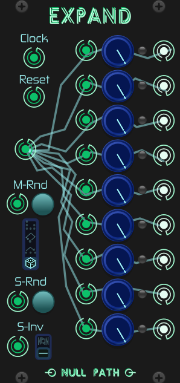
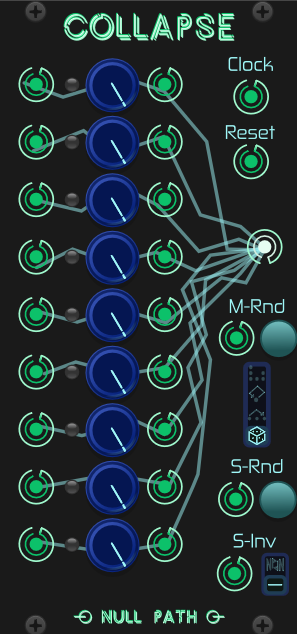
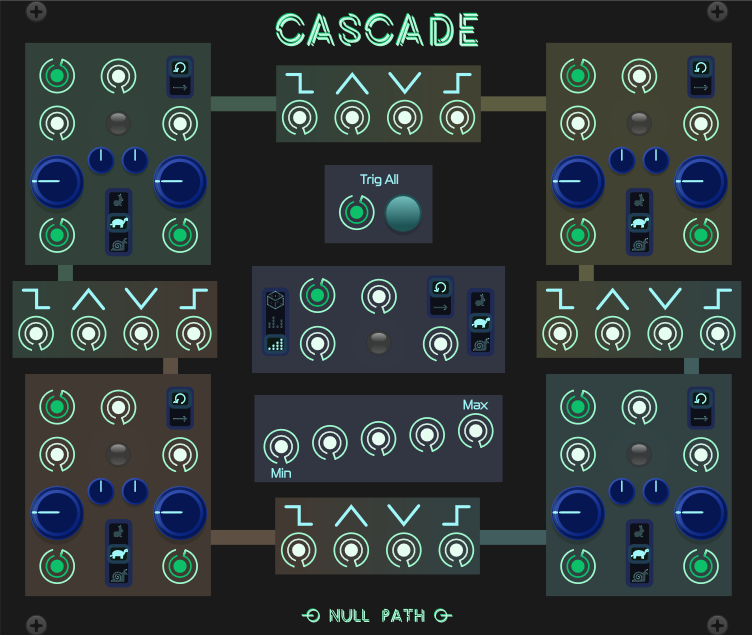
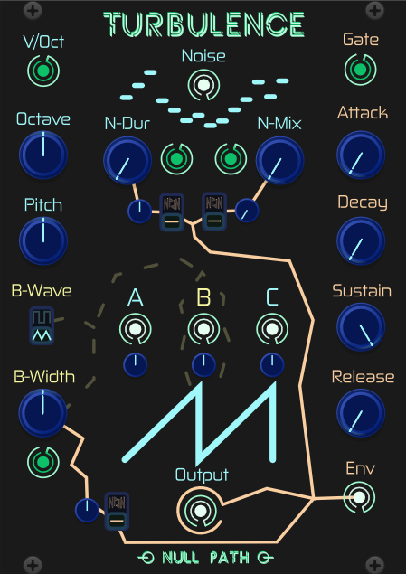

# NullPath

## Expand & Collapse

**Expand** is a 1 to 9 not-so-sequential switch. Each step has a corresponding "weight" parameter, which has different uses depending on the "Mode" switch. Each subsequent "Clock" pulse will advance the steps, choosing the next output step. Steps are only considered for choosing if their output port is connected. The "Reset" trigger input will reset the output step to 1.

**Collapse** is a 9 to 1 not-so-sequential switch. Each step has a corresponding "weight" parameter, which has different uses depending on the "Mode" switch. Each subsequent "Clock" pulse will advance the steps, choosing the next input step. Steps are only considered for choosing if their input port is connected. The "Reset" trigger input will reset the input step to 1.

Both **Expand** and **Collapse** also have CV inputs for the "weight" parameters, a "Randomize Mode" trigger input and button, a "Randomize Steps" trigger input and button, and an "Invert Weights" gate input with a switch to toggle between "invert on low" or "invert on high". They both also have an optional "Fade" toggle and "Fade Time" slider in the right click menu. When "Fade" is enabled, the modules will smoothly crossfade between steps. The "Fade Time" slider controls the duration of the fade.

MODES:

- **Select Chance** - The weight is the chance that the step will be selected. Higher weights are more likely to be selected.
- **Skip Chance** - The weight is the chance that the step will be skipped. Lower weights are more likely to be skipped.
- **Repeat Weight** - The weight is the number of times the step will be repeated. Higher weights are repeated more times.
- **Fixed Pattern** - Generates a repeated pattern where the weight controls how frequent a step will be selected.

## Cascade

**Cascade** is a 4 channel envelope/function generator, capable of generating exponential, linear, and logarithmic curves. Each channel has a "Rising" and "Falling" gate output, CV control over the rise and fall times, a speed switch, a loop toggle, and a trigger input. In between the four channels around the outside of the module, there are sections with various outputs relating to the two channels each section connects. The "Trig All" input and button will start all 4 channels and the Cascade section from the beginning of their cycles. The center "Cascade" section has 3 modes, which will determine the section's output.

MODES:

- **Each** - Each envelope will be triggered one after the other, in order (A, B, C, D).
- **Shuffle** - Each envelope will be triggered one after the other, in a random order. Once all envelopes have been triggered, the order will be reshuffled, leading to a random sequence of envelopes with no repeats.
- **Random** - A random envelope will be chosen at the end of each envelope's cycle, leading to a random sequence of envelopes with possible repeats.

## Turbulence

**Turbulence** is a supersaw oscillator, with 3 waves (2 surrounding saws, and a center wave which can be toggled between a pulse wave or a saw/triangle wave), as well as a noise generator with optional "Duration" parameter, causing "crunchier" noise. The three waves can be detuned against each other using the "Fine tune" knobs below their individual outputs. There is also a built in amplitude envelope with ADSR controls, which can also be routed to various parameters such as Noise Duration, Noise Mix, and the central wave's "width" param. When the central wave is a pulse wave, the "width" param acts as a pulse width. When the wave is set to saw/triangle, the "width" param smoothly transitions between the two waves (0 = saw, 1 = triangle). If the Noise mix or Noise duration inputs are connected, their associated parameters become attenuators for the modulation signal. There is also an item in the right click menu to toggle between an exponential and linear envelope shape.
